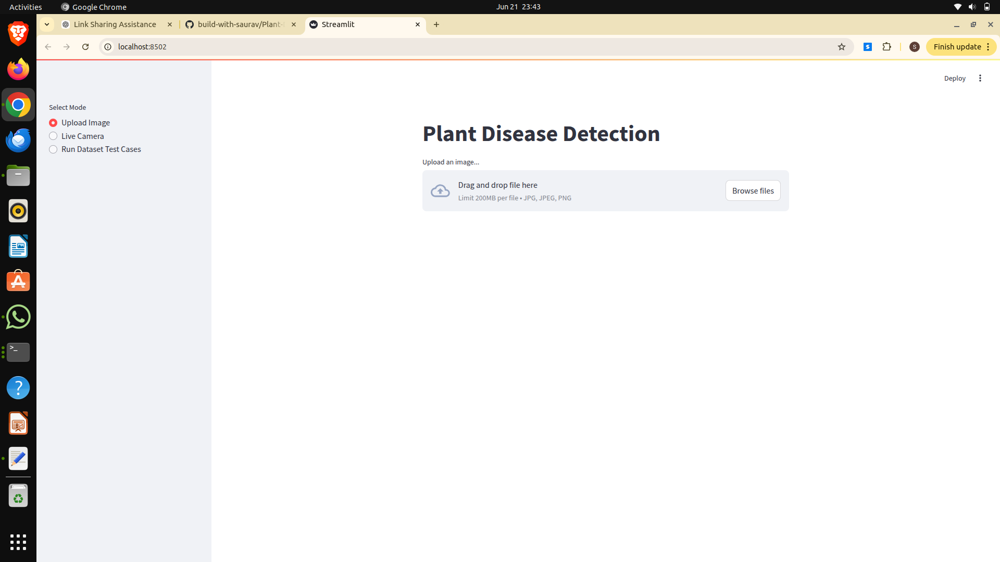
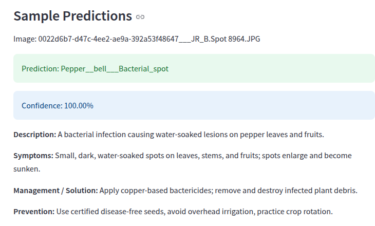
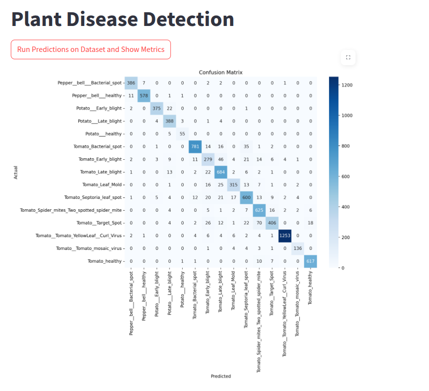
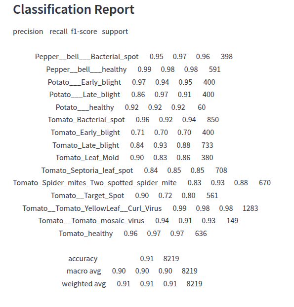

# 🌱 Plant Disease Detection AI


AI-powered plant disease detection system using **TensorFlow**, **MobileNetV2**, and **Streamlit** for detecting plant diseases from leaf images and providing actionable disease management recommendations.

---

## 🚀 Features

* Upload leaf images for plant disease prediction
* Real-time disease detection using live camera
* Validation dataset testing mode
* Confusion matrix visualization
* Classification report generation
* Disease description and symptom explanation
* Prevention and treatment recommendations
* Transfer learning based classification system

---

## 🛠 Tech Stack

* Python
* TensorFlow / Keras
* MobileNetV2
* Streamlit
* OpenCV
* NumPy
* Matplotlib
* Seaborn
* Scikit-learn

---

## 📂 Project Structure

```text
Plant-Disease-Detection-AI/
│── app.py
│── train.py
│── requirements.txt
│── disease_knowledge_base.json
│── README.md
│── .gitignore
│
├── Models/
│   ├── plant_disease_model.weights.h5
│   └── class_indices.json
│
├── Processed/
│   └── dataset files
│
├── screenshots/
│   ├── home.png
│   ├── prediction.png
│   ├── metrics.png
│   └── classification-report.png
│
├── notebooks/
│   └── experimentation.ipynb
│
└── docs/
```

---

## 📸 Application Screenshots

### 🏠 Home Page



### 🔍 Prediction Output



### 📊 Confusion Matrix



### 📑 Classification Report



---

## 📈 Results

| Metric              | Value           |
| ------------------- | --------------- |
| Validation Accuracy | **91.37%**      |
| Validation Loss     | **0.2516**      |
| Training Images     | **32903**       |
| Validation Images   | **8219**        |
| Number of Classes   | **15**          |
| Base Model          | **MobileNetV2** |

---

## ⚙ Installation

Clone the repository:

```bash
git clone https://github.com/build-with-saurav/Plant-Disease-Detection-AI.git
cd Plant-Disease-Detection-AI
```

Install dependencies:

```bash
pip install -r requirements.txt
```

---

## ▶ Running the Application

```bash
streamlit run app.py
```

---

## 🧠 Model Architecture

This project uses **MobileNetV2** as a pre-trained backbone for feature extraction.

Architecture:

* MobileNetV2 Base Model
* Global Average Pooling Layer
* Dense Layer (128 units, ReLU activation)
* Dropout Layer (0.5)
* Softmax Output Layer

This architecture helps in achieving better generalization with fewer training parameters.

---

## 🌿 Disease Knowledge Base

The system provides:

* Disease description
* Symptoms
* Prevention methods
* Treatment suggestions

This makes the model useful beyond prediction by adding practical agricultural guidance.

---

## 🔮 Future Improvements

* Grad-CAM Explainability
* Cloud Deployment
* Mobile App Version
* Multi-language Support
* Real-time Continuous Video Detection
* Treatment Recommendation Engine

---

## 👨‍💻 Author

**Saurav Singh**
Computer Science Engineer | AI/ML Enthusiast

GitHub: https://github.com/build-with-saurav
